# Neuro_Ninjas

Project Proposal: Stroke Prediction Analysis
 * this is a Group project Done by:
* Aya Fakhri
* Kyle Goodwin
* Aparajita Mondal
* David Zigun

Objective:
This project aims to analyze stroke prediction data to determine the likelihood of a person having a stroke based on various factors. By leveraging statistical analysis and machine learning techniques, we seek to uncover patterns and relationships within the dataset and develop predictive models.
 
Dataset Overview:
The dataset includes key factors that may influence stroke risk, such as:
              	•  	Demographic Information: Sex, age
              	•   Health Conditions: Presence of heart disease, BMI (Body Mass Index)
              	•   Lifestyle Factors: Smoking status
              	•   Other Features: Additional attributes included in the dataset
 
Goals:
              	1. Identify the most significant factors contributing to stroke risk.
              	2. Develop a robust predictive model to estimate stroke likelihood.
                3. Provide actionable insights to inform preventive measures and health interventions.
 
 
The source of the data is: https://www.kaggle.com/datasets/fedesoriano/stroke-prediction-dataset/data

--------------------------------------------------------------------------------------------------------------------------

# INTRODUCTION:

Stroke is a serious medical condition that occurs when the blood supply to a part of the brain is interrupted, resulting in tissue damage and neurological impairment. According to (World Stroke Organisation, 2023), around one-fourth of adults above 25 years of age will experience a stroke at least once during their lifetime. The current year is estimated to witness 12.2 million first-time stroke cases globally, with a resulting death toll of 6.5 million. Early diagnosis and treatment of stroke can reduce the risk of complications and improve the chances of recovery. However, predicting the occurrence and outcome of stroke is challenging due to the complexity and variability of stroke etiology, pathophysiology, and clinical presentation.

OBJECTIVE:

This project aims to investigate the effectiveness of SVM Model algorithms for the prediction of stroke.

# DATASET & SOURCE :

The data used for this project was gotten from Kaggle via this link  https://www.kaggle.com/datasets/fedesoriano/stroke-prediction-dataset/data. The dataset consists of 5110 observations and 12 features that includes a binary target variable. That is, 12 independent variables will be used to predict the dependent variable. 

# METHODOLOGY : use four model 

#  EDA (Exploratory Data Analysis) # Random Forest # Classification Regression # Principal Component Analysis (PCA)

# Process flow
 
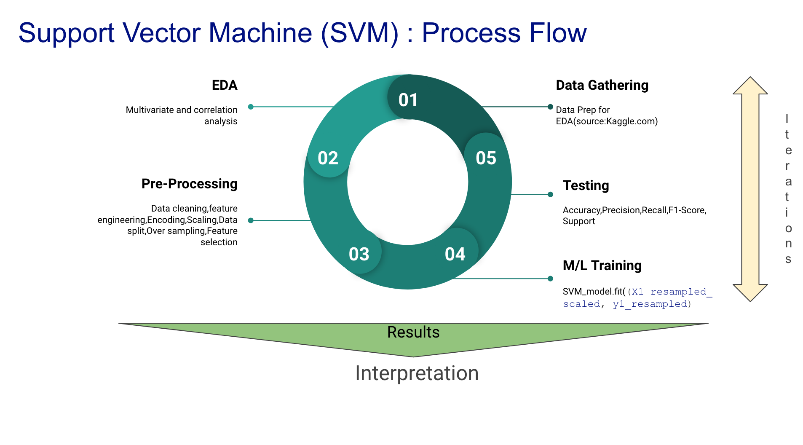

The best way to understand the structure of a data is through visualization. This will help identify obvious errors, as well as better understand patterns within the data, detect outliers, find interesting relations among the variables. . Also, age, BMI, average glucose level were binned into groups for better understanding of the data.

 

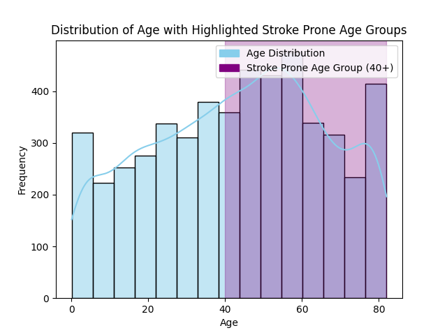

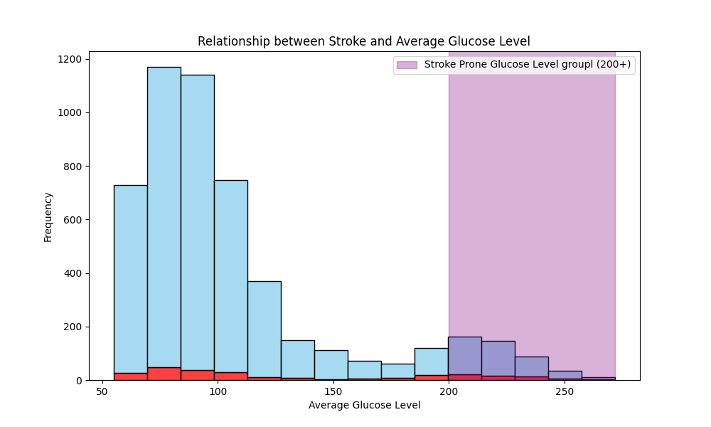

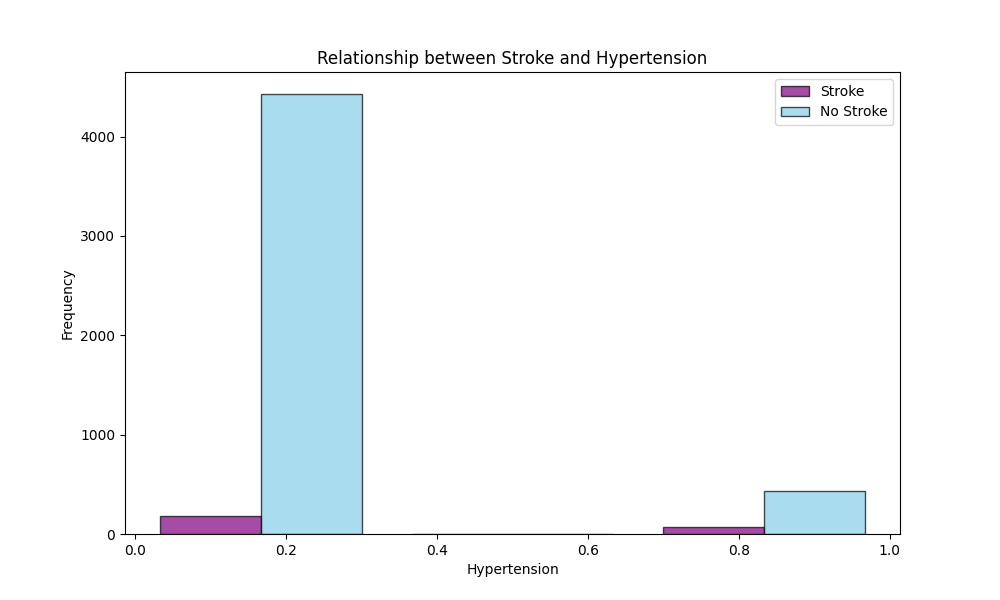

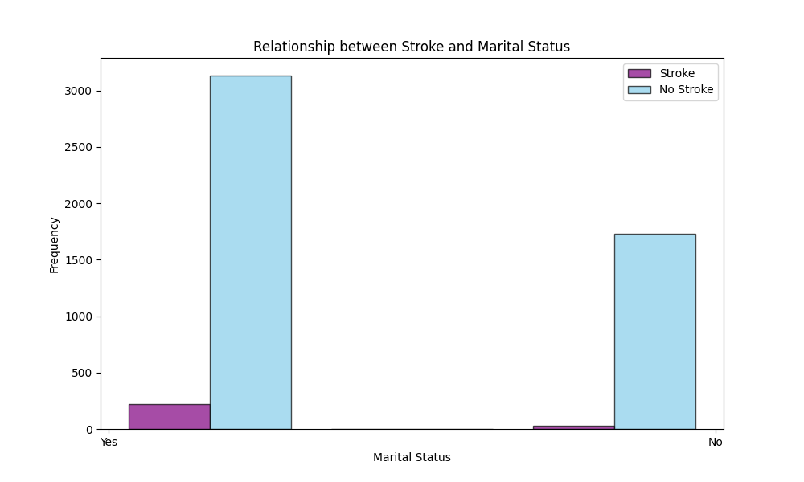

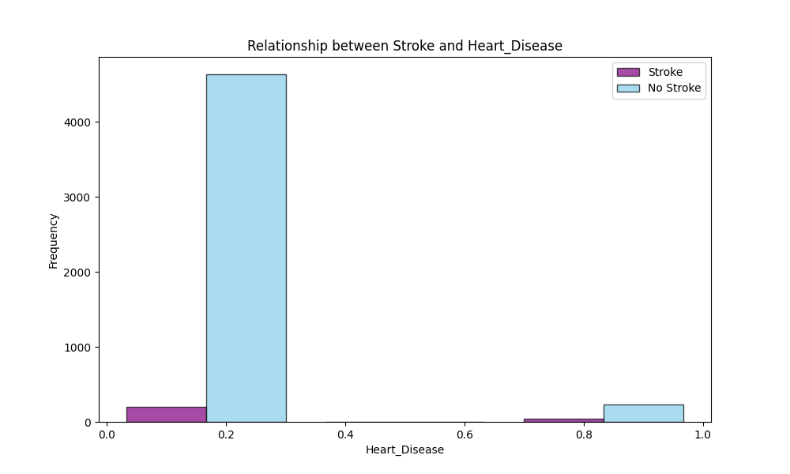

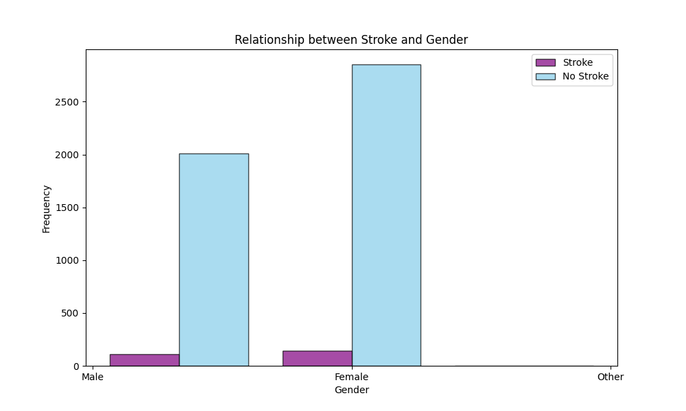

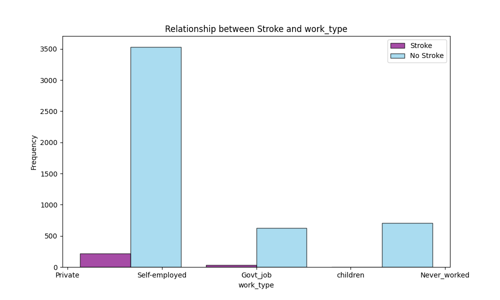

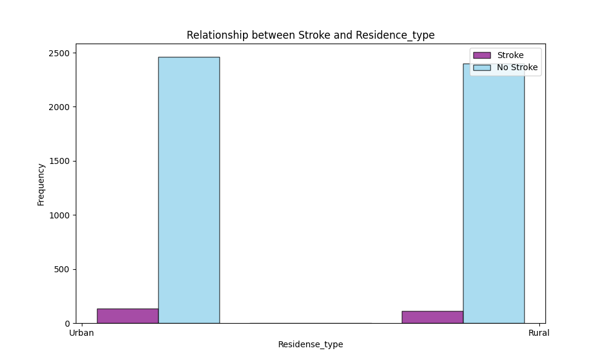

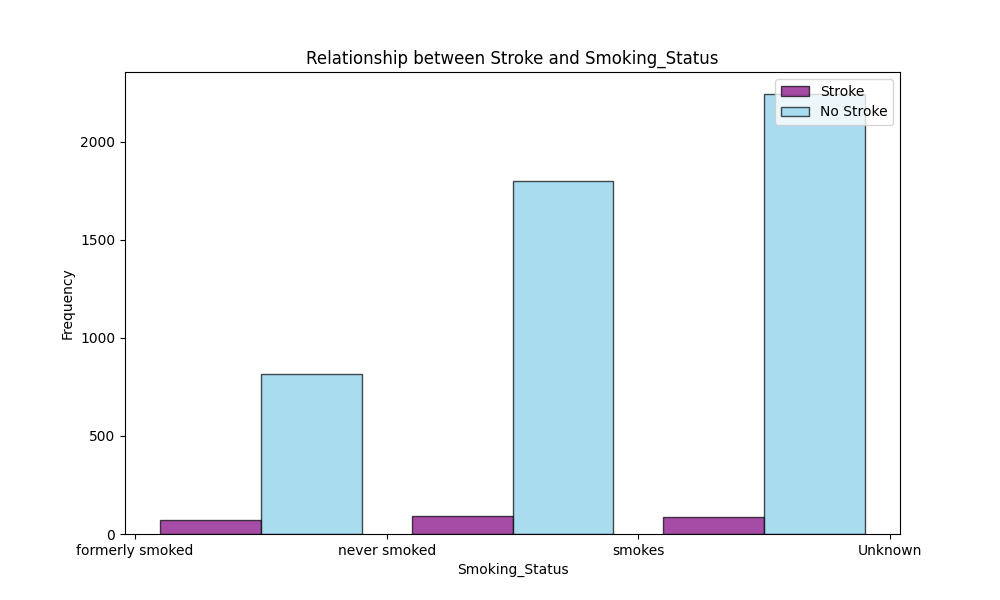

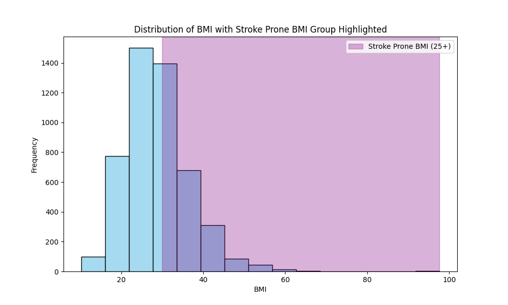

# Observations:

1. 95% of population does not prone to stroke as per the dataset .

2.There are more females as compared to males.The Patients with "other" has been recatagorsed to female .This way we'll have just 2 catagories in the cloumn .

3. Most of the population are healthy in terms of heart_diseas.

4.More than 50% of patients works at private sector .

5.With the assumption of children cannot work/never worked , we can move the instance of children  catagory to the Never_worked catagory.

6. 90% of population are not hypertensive.

7. we have more patients who have  married at one stage of their  life than who have not.

8.we have almost equal amount of patients living in Rural and Urban areas.

--------------------------------------------------------------------------

Multivariate analysis was carried out between features to look for relationship, patterns between them. Some key insights gained from this analysis are listed below:

2.More patients that are older than 40 years seems to have stroke with little number of patients less than 40 years having stroke

3.There are two children (less than 18 years) that have stroke.

4.Stroke seems to occur in patients with overweight, obesity

5.Combination of patients that formerly smoked and those that smokes have stroke than those that never smoked.

6.Patients with average glucose level higher than 150  tends to have stroke.

7.Patients who are married at a point in their life have stroke than those that have never married.

The correlation between variables was also checked using the correlation plot, and it was discovered that BMI is the least correlated with stroke, and age is the most correlated to stroke among the numerical features.

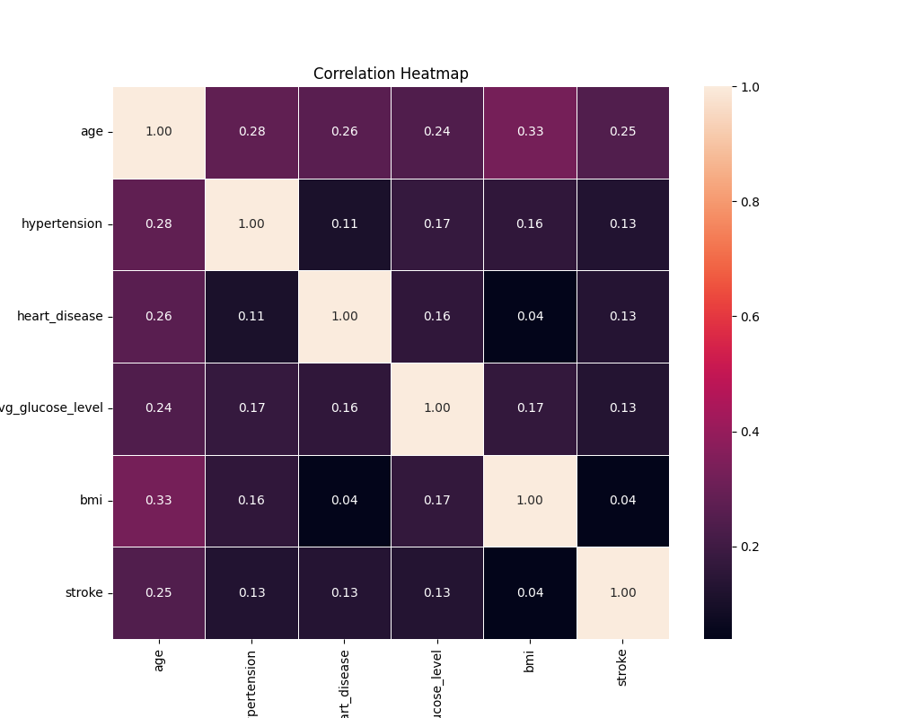

----------------------------------------------------------------------------------
DATA PRE-PROCESSING

Data Cleaning
The EDA led to identifying inconsistencies in the data. Specifically, missing values were imputed using the mean value of the BMI feature for the 201 missing observations. Additionally, the ID column, which was deemed irrelevant for the analysis, was dropped. Categorical data were also manipulated, with the gender value "other" being replaced with "female," as it was the mode in the corresponding column. Furthermore, individuals with “unknown” smoking status values who were younger than 18 years old were assumed to have never smoked, hence their smoking status was changed to “never_smoked”. Additionally, the "children" value in the "work_type" column was replaced with "never worked" as it was assumed that children had never worked. This resulted in four unique values in the column, down from the initial five.

Feature Engineering and Transformation
Age, BMI, and glucose level features were subjected to feature binning.
Ps - Stroke_data_graphs.ipynb

Data Scaling & Splitting

For data scaling, the get_dummies technique was applied.

Addressing Class Imbalance
To address the class imbalance, the Synthetic Minority Over-sampling Technique (SMOTE) was applied. This technique was introduced by (Chawla, et al., 2002). The technique works by generating synthetic data using the k-nearest neighbour (Wijaya, 2020). Only the training data was oversampled as seen in the figure below. This is to avoid data leakage and to ensure that the model generalizes well to unseen data.

original set distribution:
stroke
0    3403
1     174

Resampled set distribution:
stroke
0    3694
1   3150

Feature Selection :

To identify the most relevant features for training the models, we have used Correlation Coefficient,one of the Filter Methods:These methods evaluate the relevance of features based on statistical techniques before the model is trained.

Correlation Coefficient: Measures the correlation between each feature and the target variable. Features with high correlation are selected.

MACHINE LEARNING ALGORITHMS & EVALUATION :

In this experiment, SVM  was  trained and evaluated. The algorithm  was carefully tuned to find the  optimal parameters, aiming to achieve the best possible results. To assess the performance of the algorithm, a set of evaluation metrics was employed. These metrics include accuracy, recall, precision, f1-score.

# RESULTS :

 
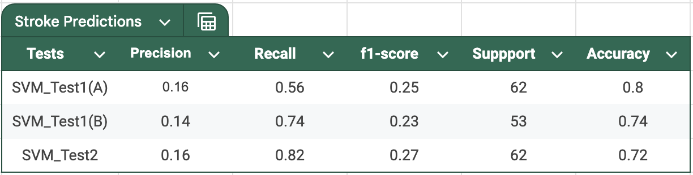

Discussion : 

-If you want a model with high overall accuracy, SVM_Test1(A) is your best choice.

-If priority is catching as many true positives as possible (high recall), go with SVM_Test2.

FUTURE WORK:

A potential future work could be to investigate the impact of other features on stroke diagnosis such as environmental factors, genetic predispositions, race, stress levels, and lifestyle habits. They could improve the performance of stroke diagnosis using machine and deep learning algorithms.

